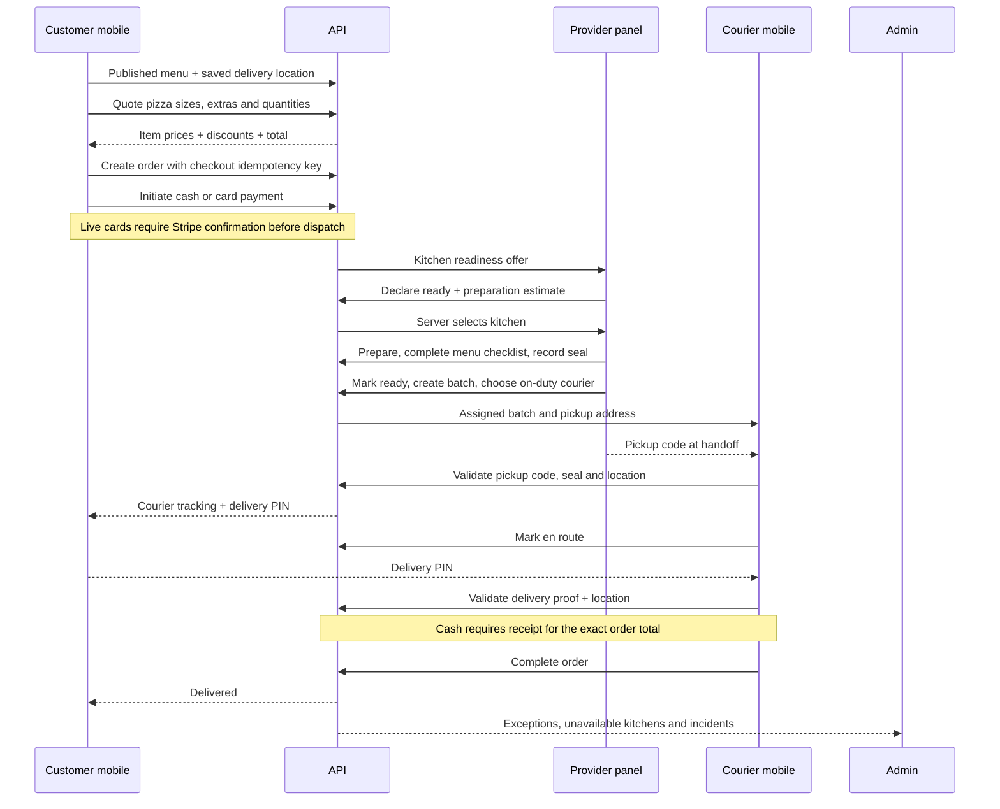

# Submitting and fulfilling a pizza order

The API is the source of truth for order prices, kitchen allocation, payment state,
and delivery custody. Each application has a separate authenticated role.



## Applications and ownership

| Application | Responsibilities | Access boundary |
| --- | --- | --- |
| Customer, port 8051 | Menu, persistent cart, delivery address, quote, payment, tracking, resume unpaid orders | Own addresses and orders; never kitchen identity or dispatch scores |
| Provider, port 8084 | Readiness offers, preparation, menu-defined quality checklist, seal, batch and courier assignment | Own kitchen's orders, batches and pickup codes |
| Courier, port 8053 | Start shift, assigned stops, directions, pickup, delivery PIN, cash receipt, completion | Assigned deliveries; pickup code comes from kitchen, door PIN from customer |
| Admin, port 8052 | Menu and role provisioning, kitchen setup, configuration, exception and incident resolution | Privileged operations endpoints |
| Website, port 8050 | Marketing | Does not submit or fulfill orders |

The courier root route opens the connected `/home/` workflow. The older simulated
`driver-dispatch-app` component is no longer its entry point.

## Checkout contracts

- `POST /orders/quote` validates the same request as order creation and returns
  `lines`, `subtotalCents`, `deliveryFeeCents`, and `totalCents`. It creates no order.
- `POST /orders` accepts `idempotencyKey`. Repeating a checkout with the same key
  returns the same order, including simultaneous requests. Reusing the key with
  different content returns 409. The unique index is scoped to the customer.
- Each line supports `size` (`small`, `medium`, `large`) and unique `extras`
  (`extra-cheese`, `jalapenos`, `olives`, `garlic-dip`). The API computes and saves
  their prices and selections. Quantities must be integers from 1 to 99.
- New orders have no delivery fee. Discounts are validated by the API. The
  payment screen presents the server quote; if creation returns a changed price,
  it asks the customer to review it before payment.
- Delivery addresses require real coordinates. Customers can use geolocation or
  enter coordinates. Orders retain an address snapshot and delivery instructions
  for the courier, even if the saved address is later removed.
- Only ASAP delivery is offered. Scheduled requests are rejected until scheduling
  can be fulfilled, rather than being silently dispatched immediately.
- Pending payment stays in the URL and order history. Reloading, cancelling the
  card form, or retrying submission resumes the existing order.
- `POST /payments/initiate` reuses existing payment records and Stripe intents.
  Payment initiation and capture are serialized per order. Live Stripe intents use
  an order-scoped Stripe idempotency key.
- `POST /payments/confirm` verifies a live intent directly with Stripe, including
  amount, currency and order metadata, then persists capture and starts dispatch.
  Signed webhooks also perform capture. Browser success alone does not submit an
  order. A missing publishable key produces an error, not a success screen.
- Local development without Stripe uses mock card capture. Production refuses
  mock card capture and unsigned webhooks.
- Customer `orderState` is `awaiting_payment`, `active`, `completed`, or `cancelled`.
  `customerStatus` remains the blind progress projection. Raw kitchen statuses are
  absent from customer order responses. Payment responses exclude provider offers.

## Handoff contracts

`GET /couriers/available` returns active on-duty courier profiles for provider/admin
selection. Batch assignment requires an on-duty courier and all pizzas ready for
pickup. Other providers cannot create, suggest, inspect or assign a kitchen's batch.

The provider screen uses the ordered menu's checklist and exposes the pickup code
once assigned. The courier must enter that code and the matching seal at the pickup
location. Universal `000000` pickup and `0000` delivery bypasses have been removed.
The courier view contains pickup/delivery addresses, delivery instructions and the
server total, but not the pickup code or customer PIN. Completed batches leave the
courier's active list after their final order is completed.

An empty dispatch wave goes to admin review because there is no offer expiry to
wake it. This keeps the paid order visible to operations instead of leaving it
waiting indefinitely.

## Verification

Install dependencies and compile the shared translations:

```sh
npm ci
npm run build --workspace=@repo/i18n
npm run test --workspace=api -- --runInBand --watchman=false
npm run test:e2e --workspace=api -- --runInBand --watchman=false
npm run test:e2e
npm run test:e2e:admin
```

The API integration suite uses a temporary MongoDB database. MongoDB Memory Server
is pinned to 7.0.24; `MONGOMS_VERSION` or `MONGOMS_SYSTEM_BINARY` can override it.
For example, on macOS with MongoDB installed through Homebrew:

```sh
MONGOMS_SYSTEM_BINARY=/opt/homebrew/bin/mongod npm run test:e2e
```

Browser tests use installed Chrome locally (bundled Chromium in CI), disposable demo data, and separate ports 8151,
8152, 8153, 8158 and 8184. The default suites do not use the developer's database or Stripe account. The separately invoked Stripe suites use the explicitly configured sandbox and disposable databases.
They exercise customer, provider and courier screens for both card and cash.
API tests additionally cover admin exception handling, role isolation, duplicate
checkout, invalid options/quantities, location checks, and cash receipt enforcement.

Stripe network/3-D Secure tests are separate from native device permission verification; local mock-card tests do
not certify those integrations.

### Verified on 2026-09-07

- Customer/kitchen/courier browser journeys passed for local mock card and cash, including address entry, size/extras, kitchen photo upload, pickup/PIN/cash receipt, completion and reorder review. Browser setup explicitly waits for the courier's shift state before deciding whether to start a shift, avoiding a page-loading race.
- A separate admin/courier browser journey passed: issue QR shift code, start, reload/resume, reject a universal code, issue a new end code, end and inspect the refund page. The separate suite limits concurrent Next development servers.
- API integration: 4 suites, 14 tests passed. Includes three customers, two kitchens and two couriers, mixed-payment multi-stop delivery, competing kitchen offers, cross-account access rejection, menu version replacement, checkout retries, payment cancellation, chat retries, code expiry/reuse, batch-assignment retry after pickup and exact cash receipt enforcement.
- Admin menu browser acceptance passed: create version/category/item, publish, edit name/price, hide/show, refresh persistence and mobile overflow checks. See [multi-user acceptance](MULTI-USER-ACCEPTANCE.md) and [visual consistency](UI-CONSISTENCY.md).
- Stripe sandbox API: 3 real-network tests passed, including signed CLI-forwarded webhook delivery, kitchen offer visibility and role isolation, invalid signature/replay checks, decline/retry, pending 3DS cancellation and exactly one refund after repeated reconciliation.
- Stripe browser checkout: 3 real sandbox scenarios passed (Visa, completed 3DS challenge, decline/retry). Each reached order success with captured payment; all three cleanup refunds were confirmed directly in Stripe. These tests create orders through the API; the separate default browser journeys cover cart/address entry and kitchen/courier screens.
- API unit tests: 13 suites, 71 tests passed, including Stripe refund states, payment amount/ownership checks, sandbox mode enforcement, FCM retry/removal and realtime authorization.
- Workspace TypeScript checks and lint passed using `npm run check-types --workspaces --if-present` and `npm run lint --workspaces --if-present`. Existing API formatting and website lint warnings remain. The local Turbo executable failed to spawn (`Unknown system error -88`), so equivalent workspace commands were used.
- API and all four ordering application production builds passed with `--webpack`. The builds fetched the existing Google font with network access.
- Capacitor sync succeeded for Android and iOS in both mobile apps. This is asset/plugin synchronization, not native compilation or a physical-device test. Firebase is excluded from unconfigured native builds until app configuration files are added.
- Reference migration audit, nested conversion and repeated apply passed against disposable MongoDB. Staging Compose and backup scripts passed syntax/configuration checks; no deployment or real backup restore was performed.

See [Release readiness](RELEASE-READINESS.md) for external service and device acceptance gates.
